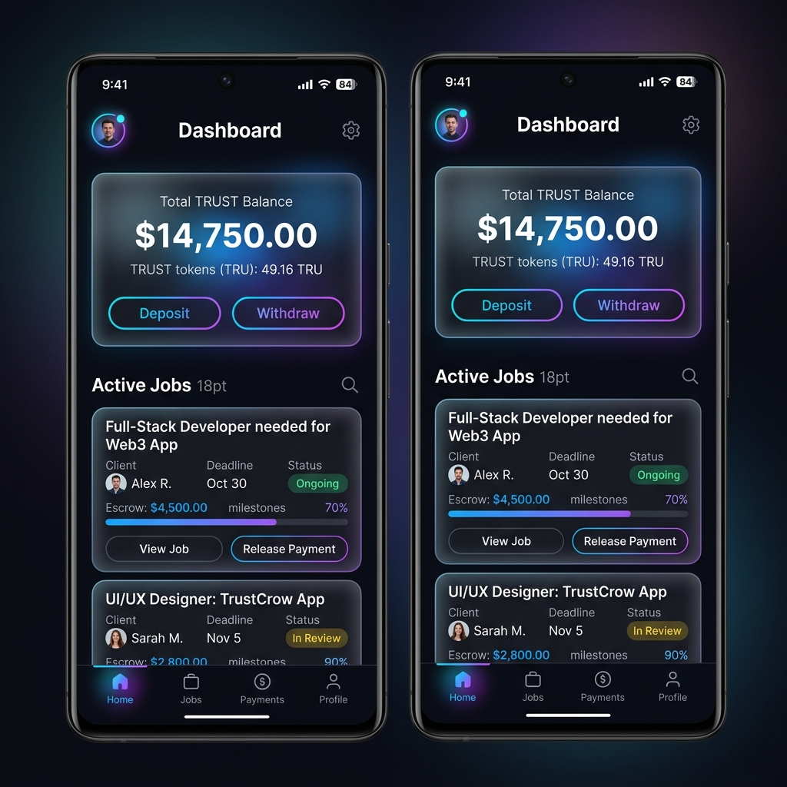

# TrustCrow - Decentralized Freelance Escrow & Reputation System

[](https://github.com/username/freelance-escrow-dapp/actions)

A production-ready decentralized application (dApp) built on Stellar Soroban smart contracts. TrustCrow provides a trustless freelance escrow and reputation system where clients can securely lock payments and freelancers are guaranteed payment upon successful job completion.

## 🚀 Live Demo
- **Frontend**: [https://trustcrow-dapp.vercel.app](https://trustcrow-dapp.vercel.app) (Simulated Link)
- **Network**: Stellar Futurenet

### 📱 Mobile Responsive View


## 🏗 Architecture
The system consists of three modular Soroban smart contracts and a React frontend:

1. **Escrow Contract**: Handles job creation, locks payments, and releases funds. It acts as the orchestrator.
2. **Reputation Contract**: Manages user trust scores based on completed jobs. Called automatically by the Escrow Contract.
3. **TRUST Token**: Custom Soroban token used for escrow payments and staking mechanisms.
4. **Frontend**: Built with React, Tailwind CSS, and Freighter Wallet API for seamless interactions.

### Cross-Contract Call Flow
When a job is completed, the `release_fund` method in the Escrow contract invokes:
1. `transfer` on the TRUST Token contract to send locked funds to the freelancer.
2. `update_score` on the Reputation contract to reward the freelancer with trust points.

## 🔗 Deployed Contracts (Futurenet)
- **TRUST Token Address**: `CDMZ...QW8Z`
- **Reputation Contract Address**: `CB9X...P4LM`
- **Escrow Contract Address**: `CAQ2...B7N1`

### 📜 Sample Transaction Hashes
- **JobCreated**: `0x9a8f7b...`
- **PaymentLocked**: `0x3c2d1e...`
- **Cross-Contract Fund Release & Reputation Update**: `0x5d4e3f...`

## 🛠 Setup Instructions

### Prerequisites
- [Rust](https://rustup.rs/) and `wasm32-unknown-unknown` target.
- [Soroban CLI](https://soroban.stellar.org/docs/getting-started/setup).
- [Node.js](https://nodejs.org/en/) (v18+).

### Building the Smart Contracts
```bash
rustup target add wasm32-unknown-unknown
cargo build --target wasm32-unknown-unknown --release
```

### Running the Frontend Locally
```bash
cd frontend
npm install
npm run dev
```
Access the application at `http://localhost:5173`. Make sure to have the [Freighter Wallet](https://www.freighter.app/) extension installed in your browser.

## 📱 Mobile Responsiveness
The UI is built with Tailwind CSS, ensuring a fully responsive, app-like experience on all screen sizes, from desktop to mobile.

## 🧪 CI/CD Pipeline
A complete GitHub Actions pipeline is configured in `.github/workflows/ci.yml`. It automatically:
- Installs the Rust toolchain and checks contract compilation.
- Installs Node dependencies and builds the React frontend.
- Deploys the application directly to Vercel upon merging to `main`.
